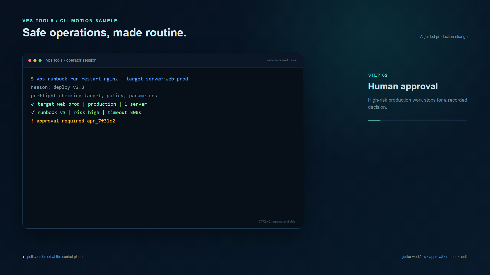

# CLI motion sample

This folder contains Remotion compositions showing VPS Tools in operation.



The preview shows a high-risk production runbook stopping at the approval gate. The rendered samples continue through approval, runner execution, verification, and audit completion.

`CliWorkflow` presents a production change from the CLI. `SelfContainedInstall` presents the first-boot installation path.

The animation covers:

- guided runbook preflight
- production risk and approval gating
- approval recording
- runner lease and execution progress
- post-execution verification
- redacted output and audit completion

## Render locally

```bash
npm install
npm run check
npm run studio
npm run render
```

The rendered file is written to `out/vps-tools-cli-workflow.mp4`.

Render the self-contained installation sample with:

```bash
npm run render-install
```

That file is written to `out/vps-tools-self-contained-install.mp4`.
