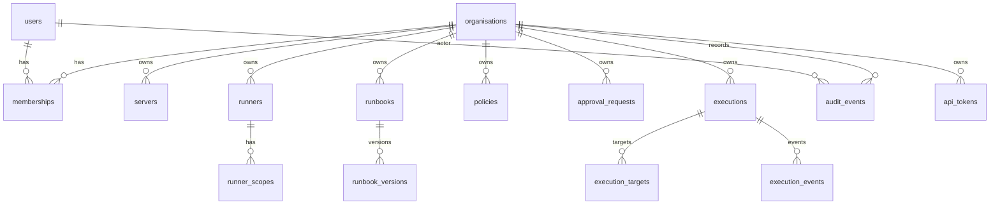

# VPS Tools Data Model and Initial Schema Spec

**Working title:** VPS Tools  
**Document status:** Draft v1  
**Date:** 18 May 2026  
**Related documents:** VPS Tools PRD; VPS Tools Technical Specification; VPS Tools MVP Build Plan; VPS Tools Architecture Decision Records  
**Primary audience:** Engineering, architecture, database, security  

---

## 1. Purpose

This document defines the initial MVP data model and PostgreSQL schema direction for VPS Tools.

It is intended to guide:

- Initial database migrations.
- sqlc query design.
- API contract design.
- Authorisation checks.
- Audit event creation.
- Runner job lifecycle.
- CLI and web console data requirements.

The goal is to define enough schema to build the MVP without overbuilding future enterprise, billing, MSP, or compliance features too early.

---

## 2. Design Principles

### 2.1 Tenant Isolation First

VPS Tools is multi-tenant by design, even when self-hosted.

Most operational tables must include `organisation_id`.

This applies to:

- Servers.
- Runners.
- Runbooks.
- Policies.
- Approvals.
- Executions.
- Audit events.
- API tokens.

Even if the first open-source self-hosted install has only one organisation, the schema should not assume single-tenancy.

### 2.2 Audit Is a Product Primitive

Audit events are not application logs.

Audit events must be:

- Structured.
- Organisation-scoped.
- Append-only at application level.
- Linked to important business entities where relevant.
- Searchable by actor, target, action, result, and date.

### 2.3 Prefer Explicit Relational Models

Use relational tables for core entities and relationships.

Use JSONB only for flexible metadata, external provider data, policy documents, and event details where strict columns would create unnecessary churn.

### 2.4 MVP Does Not Need the Final Enterprise Schema

The schema should support the MVP and obvious near-term evolution, but should not model every future feature.

Defer:

- Billing accounts.
- Detailed licence enforcement.
- Compliance reports.
- Session recordings.
- MSP client hierarchy.
- Full team hierarchy.
- Provider inventory sync.
- Advanced notification delivery history.

### 2.5 Denormalise Carefully for Audit and History

For audit and execution history, preserve point-in-time context.

For example:

- Store `actor_role_at_time` on audit events.
- Store `command_preview` and `command_hash` on executions.
- Store `runbook_version_id`, not just `runbook_id`.
- Store target names and metadata snapshots where useful.

Do not rely entirely on current state when displaying historic activity.

---

## 3. PostgreSQL Conventions

### 3.1 ID Strategy

Use string IDs with typed prefixes, generated by the application.

Examples:

```text
org_01hx...
usr_01hx...
mem_01hx...
srv_01hx...
rnr_01hx...
rbk_01hx...
rbv_01hx...
pol_01hx...
apr_01hx...
exe_01hx...
ext_01hx...
aud_01hx...
tok_01hx...
```

Recommended format:

- Prefix plus ULID or UUIDv7-compatible sortable identifier.
- Stored as `text` in PostgreSQL for readability and easier debugging.

Rationale:

- Easier to identify entity type in logs and support requests.
- Sortable IDs are useful for time-ordered data.
- Avoids leaking sequential integer counts.

### 3.2 Timestamp Columns

Use `timestamptz` for all timestamps.

Standard columns:

```sql
created_at timestamptz not null default now()
updated_at timestamptz not null default now()
```

For append-only/event tables, `updated_at` is usually unnecessary.

### 3.3 Soft Deletion and Archiving

Use status fields for important entities rather than immediate hard delete.

Examples:

- `servers.status = 'archived'`
- `users.status = 'disabled'`
- `runbooks.status = 'disabled'`
- `api_tokens.revoked_at is not null`

Hard deletion should be rare and usually limited to development/test data or explicit retention cleanup jobs.

### 3.4 JSONB Usage

Use JSONB for:

- Metadata.
- Provider-specific details.
- Policy documents.
- Runbook schema body.
- Audit event details.
- Execution target snapshots.

Do not use JSONB as a substitute for core queryable columns.

If a field is routinely filtered, joined, or authorised against, it should usually be a column.

### 3.5 Naming

Use snake_case table and column names.

Use plural table names:

```text
organisations
users
memberships
servers
runners
executions
audit_events
```

### 3.6 Database Roles

At minimum, plan for:

| Role | Purpose |
|---|---|
| migration_role | Applies schema migrations |
| app_role | Normal API and runner database access |
| readonly_role | Reporting/support read-only access |
| maintenance_role | Retention cleanup and administrative maintenance |

The `app_role` should not be able to update or delete audit events.

---

## 4. MVP Tables Overview

### 4.1 Required MVP Tables

```text
organisations
users
memberships
servers
server_tags
runners
runner_scopes
runbooks
runbook_versions
policies
approval_requests
executions
execution_targets
execution_events
audit_events
api_tokens
```

### 4.2 Optional Late-MVP Tables

```text
server_groups
server_group_memberships
ssh_credentials
object_refs
notification_events
```

These may be added during MVP if the first implementation needs them, but they should not block the first execution/audit vertical slice.

### 4.3 Deferred Post-MVP Tables

```text
teams
team_memberships
billing_accounts
licences
session_recordings
compliance_reports
provider_accounts
provider_sync_runs
webhook_endpoints
webhook_deliveries
```

---

## 5. Entity Relationship Summary



---

## 6. Enumerations

Use PostgreSQL enums only if the values are stable. For fast-moving MVP work, `text` plus check constraints may be more flexible.

Recommended MVP approach:

- Use `text` columns.
- Add check constraints for stable values.
- Keep enum definitions mirrored in Go constants.

### 6.1 User Status

```text
active
disabled
invited
```

### 6.2 Membership Role

```text
owner
admin
senior_engineer
junior_engineer
auditor
```

Potential later role:

```text
engineer
```

Do not add `engineer` until its permissions and SaaS pricing treatment are decided.

### 6.3 Server Status

```text
active
unreachable
archived
pending
```

### 6.4 Environment

Use text rather than a strict enum because customers may have custom environments.

Recommended defaults:

```text
development
staging
production
```

### 6.5 Runner Status

```text
pending
active
offline
revoked
```

### 6.6 Runbook Status

```text
draft
published
disabled
archived
```

### 6.7 Risk Level

```text
low
medium
high
critical
```

### 6.8 Approval Status

```text
pending
approved
denied
expired
cancelled
```

### 6.9 Execution Status

```text
created
policy_denied
awaiting_approval
queued
claimed
running
succeeded
partial_failed
failed
cancelled
timed_out
```

### 6.10 Execution Target Status

```text
pending
claimed
running
succeeded
failed
cancelled
timed_out
skipped
```

### 6.11 Audit Result

```text
success
failure
denied
queued
cancelled
expired
```

### 6.12 Token Type

```text
cli_session
api_token
runner_registration
runner_identity
```

---

## 7. Core Table Specifications

## 7.1 organisations

### Purpose

Represents a tenant or workspace.

In SaaS, each customer normally has at least one organisation. In self-hosted open-source installs, there may still be only one organisation, but the schema should support more.

### Columns

```sql
create table organisations (
    id text primary key,
    name text not null,
    slug text not null unique,
    status text not null default 'active',
    edition text not null default 'open_source',
    plan text,
    settings jsonb not null default '{}'::jsonb,
    created_at timestamptz not null default now(),
    updated_at timestamptz not null default now(),

    constraint organisations_status_check
        check (status in ('active', 'suspended', 'archived')),

    constraint organisations_edition_check
        check (edition in ('open_source', 'supported_self_hosted', 'saas'))
);
```

### Notes

- `edition` supports product packaging without implementing full billing.
- `plan` can remain nullable for MVP.
- `settings` can store defaults such as timezone, audit retention, production safeguards, and runner defaults.

### Indexes

```sql
create unique index organisations_slug_idx on organisations (slug);
```

---

## 7.2 users

### Purpose

Represents a human or system identity known to the control plane.

Service accounts can either use `users` with `user_type = 'service'`, or be modelled later as a separate table. For MVP, keeping service identity in `users` is acceptable if clearly typed.

### Columns

```sql
create table users (
    id text primary key,
    email text not null unique,
    display_name text not null,
    user_type text not null default 'human',
    status text not null default 'active',
    external_subject text,
    external_provider text,
    mfa_enabled boolean not null default false,
    last_login_at timestamptz,
    created_at timestamptz not null default now(),
    updated_at timestamptz not null default now(),

    constraint users_user_type_check
        check (user_type in ('human', 'service')),

    constraint users_status_check
        check (status in ('active', 'disabled', 'invited'))
);
```

### Notes

- `external_subject` stores OIDC subject where available.
- `external_provider` identifies the IdP.
- `mfa_enabled` may be derived from IdP claims later, but the column is useful for audit/reporting.

### Indexes

```sql
create unique index users_email_lower_idx on users (lower(email));
create index users_external_identity_idx on users (external_provider, external_subject);
```

---

## 7.3 memberships

### Purpose

Links users to organisations with roles.

This is the main MVP access-control table before deeper team/project models are added.

### Columns

```sql
create table memberships (
    id text primary key,
    organisation_id text not null references organisations(id),
    user_id text not null references users(id),
    role text not null,
    status text not null default 'active',
    invited_by_user_id text references users(id),
    invited_at timestamptz,
    accepted_at timestamptz,
    disabled_at timestamptz,
    created_at timestamptz not null default now(),
    updated_at timestamptz not null default now(),

    constraint memberships_role_check
        check (role in ('owner', 'admin', 'senior_engineer', 'junior_engineer', 'auditor')),

    constraint memberships_status_check
        check (status in ('active', 'invited', 'disabled')),

    constraint memberships_unique_user_org
        unique (organisation_id, user_id)
);
```

### Notes

- A user can belong to multiple organisations.
- Role is organisation-scoped in the MVP.
- Team/project scopes are deferred.

### Indexes

```sql
create index memberships_user_id_idx on memberships (user_id);
create index memberships_org_role_idx on memberships (organisation_id, role);
create index memberships_org_status_idx on memberships (organisation_id, status);
```

---

## 7.4 servers

### Purpose

Represents a VPS or Linux server managed by VPS Tools.

### Columns

```sql
create table servers (
    id text primary key,
    organisation_id text not null references organisations(id),
    name text not null,
    hostname text,
    public_ip inet,
    private_ip inet,
    ssh_port integer not null default 22,
    ssh_username text,
    environment text not null default 'development',
    provider text,
    provider_region text,
    provider_server_id text,
    os_name text,
    os_version text,
    kernel_version text,
    architecture text,
    status text not null default 'pending',
    last_seen_at timestamptz,
    last_check_at timestamptz,
    archived_at timestamptz,
    metadata jsonb not null default '{}'::jsonb,
    created_by_user_id text references users(id),
    created_at timestamptz not null default now(),
    updated_at timestamptz not null default now(),

    constraint servers_status_check
        check (status in ('active', 'unreachable', 'archived', 'pending')),

    constraint servers_unique_name_per_org
        unique (organisation_id, name),

    constraint servers_ssh_port_check
        check (ssh_port > 0 and ssh_port <= 65535)
);
```

### Notes

- Either `hostname`, `public_ip`, or `private_ip` should be present. This can be enforced in application logic initially.
- `ssh_username` is not a secret.
- SSH private keys or credentials should not be stored directly in this table.
- `environment` is text to allow customer-specific names, but product defaults should encourage `development`, `staging`, and `production`.

### Indexes

```sql
create index servers_org_status_idx on servers (organisation_id, status);
create index servers_org_environment_idx on servers (organisation_id, environment);
create index servers_org_provider_idx on servers (organisation_id, provider);
create index servers_last_seen_idx on servers (organisation_id, last_seen_at desc);
create index servers_public_ip_idx on servers (public_ip);
create index servers_private_ip_idx on servers (private_ip);
```

---

## 7.5 server_tags

### Purpose

Stores key/value tags for targeting, grouping, search, and policy.

Tags are central to MVP targeting and can delay the need for explicit static server groups.

### Columns

```sql
create table server_tags (
    organisation_id text not null references organisations(id),
    server_id text not null references servers(id) on delete cascade,
    key text not null,
    value text not null,
    created_at timestamptz not null default now(),

    primary key (organisation_id, server_id, key),

    constraint server_tags_key_not_empty
        check (length(trim(key)) > 0),

    constraint server_tags_value_not_empty
        check (length(trim(value)) > 0)
);
```

### Notes

- Key/value tag model allows selectors like `env=production`, `role=web`, `customer=acme`.
- `organisation_id` is duplicated intentionally to simplify tenant-scoped queries and indexes.

### Indexes

```sql
create index server_tags_org_key_value_idx on server_tags (organisation_id, key, value);
create index server_tags_server_idx on server_tags (server_id);
```

---

## 7.6 runners

### Purpose

Represents an execution runner that can claim and run approved jobs.

A runner may be SaaS-hosted, customer-managed, or local self-hosted.

### Columns

```sql
create table runners (
    id text primary key,
    organisation_id text not null references organisations(id),
    name text not null,
    runner_type text not null default 'customer_managed',
    status text not null default 'pending',
    version text,
    hostname text,
    platform text,
    architecture text,
    ip_address inet,
    last_seen_at timestamptz,
    registered_by_user_id text references users(id),
    registered_at timestamptz,
    revoked_at timestamptz,
    metadata jsonb not null default '{}'::jsonb,
    created_at timestamptz not null default now(),
    updated_at timestamptz not null default now(),

    constraint runners_unique_name_per_org
        unique (organisation_id, name),

    constraint runners_type_check
        check (runner_type in ('customer_managed', 'saas_hosted', 'self_hosted_local')),

    constraint runners_status_check
        check (status in ('pending', 'active', 'offline', 'revoked'))
);
```

### Notes

- `last_seen_at` drives runner status display.
- Revoked runners must not claim new jobs.
- Runner authentication material should not be stored directly here unless hashed/public.

### Indexes

```sql
create index runners_org_status_idx on runners (organisation_id, status);
create index runners_last_seen_idx on runners (organisation_id, last_seen_at desc);
```

---

## 7.7 runner_scopes

### Purpose

Defines which environments, tags, or servers a runner is allowed to operate against.

This limits blast radius if a runner is misconfigured or compromised.

### Columns

```sql
create table runner_scopes (
    id text primary key,
    organisation_id text not null references organisations(id),
    runner_id text not null references runners(id) on delete cascade,
    scope_type text not null,
    scope_value text not null,
    created_at timestamptz not null default now(),

    constraint runner_scopes_type_check
        check (scope_type in ('environment', 'tag', 'server', 'all')),

    constraint runner_scopes_unique
        unique (runner_id, scope_type, scope_value)
);
```

### Examples

```text
scope_type='environment', scope_value='production'
scope_type='tag', scope_value='role=web'
scope_type='server', scope_value='srv_01hx...'
scope_type='all', scope_value='*'
```

### Indexes

```sql
create index runner_scopes_runner_idx on runner_scopes (runner_id);
create index runner_scopes_org_type_value_idx on runner_scopes (organisation_id, scope_type, scope_value);
```

---

## 7.8 runbooks

### Purpose

Represents a logical runbook. Actual executable content is versioned in `runbook_versions`.

### Columns

```sql
create table runbooks (
    id text primary key,
    organisation_id text not null references organisations(id),
    name text not null,
    title text not null,
    description text,
    status text not null default 'draft',
    current_version_id text,
    created_by_user_id text not null references users(id),
    created_at timestamptz not null default now(),
    updated_at timestamptz not null default now(),
    archived_at timestamptz,

    constraint runbooks_unique_name_per_org
        unique (organisation_id, name),

    constraint runbooks_status_check
        check (status in ('draft', 'published', 'disabled', 'archived'))
);
```

### Notes

- `current_version_id` references `runbook_versions(id)` but may need to be added as a foreign key after both tables exist.
- `name` should be CLI-safe: lowercase, hyphenated, stable.

### Indexes

```sql
create index runbooks_org_status_idx on runbooks (organisation_id, status);
create index runbooks_created_by_idx on runbooks (created_by_user_id);
```

---

## 7.9 runbook_versions

### Purpose

Stores immutable published or draft versions of runbooks.

Executions should reference a specific `runbook_version_id`.

### Columns

```sql
create table runbook_versions (
    id text primary key,
    organisation_id text not null references organisations(id),
    runbook_id text not null references runbooks(id) on delete cascade,
    version integer not null,
    status text not null default 'draft',
    risk_level text not null default 'medium',
    definition_yaml text not null,
    definition_json jsonb not null,
    parameter_schema jsonb not null default '{}'::jsonb,
    target_constraints jsonb not null default '{}'::jsonb,
    approval_rules jsonb not null default '{}'::jsonb,
    command_preview text,
    command_hash text,
    created_by_user_id text not null references users(id),
    published_by_user_id text references users(id),
    published_at timestamptz,
    created_at timestamptz not null default now(),

    constraint runbook_versions_unique_version
        unique (runbook_id, version),

    constraint runbook_versions_status_check
        check (status in ('draft', 'published', 'disabled', 'archived')),

    constraint runbook_versions_risk_check
        check (risk_level in ('low', 'medium', 'high', 'critical'))
);
```

### Notes

- `definition_yaml` preserves exactly what the user authored.
- `definition_json` stores parsed/validated structure for easier querying and execution.
- Published versions should be immutable at application level.

### Indexes

```sql
create index runbook_versions_org_status_idx on runbook_versions (organisation_id, status);
create index runbook_versions_runbook_idx on runbook_versions (runbook_id, version desc);
create index runbook_versions_risk_idx on runbook_versions (organisation_id, risk_level);
```

---

## 7.10 policies

### Purpose

Stores structured MVP policy documents.

Policies define rules such as:

- Junior users may execute selected runbooks only.
- Production actions require reason.
- Production restarts require approval.
- High-risk commands require approval.

### Columns

```sql
create table policies (
    id text primary key,
    organisation_id text not null references organisations(id),
    name text not null,
    description text,
    status text not null default 'active',
    priority integer not null default 100,
    policy_type text not null,
    document jsonb not null,
    created_by_user_id text not null references users(id),
    updated_by_user_id text references users(id),
    created_at timestamptz not null default now(),
    updated_at timestamptz not null default now(),

    constraint policies_unique_name_per_org
        unique (organisation_id, name),

    constraint policies_status_check
        check (status in ('active', 'disabled', 'archived')),

    constraint policies_type_check
        check (policy_type in ('execution', 'approval', 'access', 'audit'))
);
```

### Notes

- Keep policy documents structured and versionable later.
- MVP may ship with default built-in policies seeded per organisation.

### Indexes

```sql
create index policies_org_status_type_idx on policies (organisation_id, status, policy_type);
create index policies_org_priority_idx on policies (organisation_id, priority asc);
```

---

## 7.11 approval_requests

### Purpose

Represents a request for approval to execute an action or gain temporary access.

### Columns

```sql
create table approval_requests (
    id text primary key,
    organisation_id text not null references organisations(id),
    requester_user_id text not null references users(id),
    approver_user_id text references users(id),
    action_type text not null,
    status text not null default 'pending',
    risk_level text not null default 'medium',
    reason text not null,
    target_type text not null,
    target_id text,
    target_snapshot jsonb not null default '{}'::jsonb,
    request_payload jsonb not null default '{}'::jsonb,
    related_execution_id text,
    related_runbook_version_id text references runbook_versions(id),
    expires_at timestamptz not null,
    decided_at timestamptz,
    decision_note text,
    created_at timestamptz not null default now(),

    constraint approval_requests_status_check
        check (status in ('pending', 'approved', 'denied', 'expired', 'cancelled')),

    constraint approval_requests_risk_check
        check (risk_level in ('low', 'medium', 'high', 'critical')),

    constraint approval_requests_target_type_check
        check (target_type in ('server', 'server_selector', 'runbook', 'execution', 'access'))
);
```

### Notes

- `related_execution_id` can reference `executions(id)` after executions table exists, or remain unenforced initially to avoid circular migration friction.
- `target_snapshot` preserves point-in-time target context.
- Approval grants must expire.

### Indexes

```sql
create index approval_requests_org_status_idx on approval_requests (organisation_id, status);
create index approval_requests_requester_idx on approval_requests (requester_user_id, created_at desc);
create index approval_requests_approver_idx on approval_requests (approver_user_id, created_at desc);
create index approval_requests_expires_idx on approval_requests (organisation_id, expires_at);
```

---

## 7.12 executions

### Purpose

Represents a command, runbook, or built-in operation requested by a user or service account.

### Columns

```sql
create table executions (
    id text primary key,
    organisation_id text not null references organisations(id),
    actor_user_id text not null references users(id),
    actor_role_at_time text not null,
    execution_type text not null,
    status text not null default 'created',
    risk_level text not null default 'medium',
    environment text,
    reason text,
    command_preview text,
    command_hash text,
    runbook_id text references runbooks(id),
    runbook_version_id text references runbook_versions(id),
    approval_request_id text references approval_requests(id),
    target_selector jsonb not null default '{}'::jsonb,
    target_count integer not null default 0,
    concurrency_limit integer not null default 1,
    timeout_seconds integer not null default 300,
    requested_at timestamptz not null default now(),
    queued_at timestamptz,
    started_at timestamptz,
    finished_at timestamptz,
    cancelled_at timestamptz,
    cancellation_requested_by_user_id text references users(id),
    error_summary text,
    metadata jsonb not null default '{}'::jsonb,

    constraint executions_type_check
        check (execution_type in ('raw_command', 'runbook', 'builtin_operation', 'health_check')),

    constraint executions_status_check
        check (status in ('created', 'policy_denied', 'awaiting_approval', 'queued', 'claimed', 'running', 'succeeded', 'partial_failed', 'failed', 'cancelled', 'timed_out')),

    constraint executions_risk_check
        check (risk_level in ('low', 'medium', 'high', 'critical')),

    constraint executions_target_count_check
        check (target_count >= 0),

    constraint executions_concurrency_check
        check (concurrency_limit > 0),

    constraint executions_timeout_check
        check (timeout_seconds > 0)
);
```

### Notes

- `actor_role_at_time` preserves audit context even if role changes later.
- `command_preview` must be redacted.
- `command_hash` allows correlation without storing raw secrets.
- `target_selector` stores how targets were requested, not just resolved targets.

### Indexes

```sql
create index executions_org_status_idx on executions (organisation_id, status);
create index executions_actor_idx on executions (actor_user_id, requested_at desc);
create index executions_org_requested_idx on executions (organisation_id, requested_at desc);
create index executions_runbook_version_idx on executions (runbook_version_id);
create index executions_approval_idx on executions (approval_request_id);
```

---

## 7.13 execution_targets

### Purpose

Represents each server targeted by an execution.

This table is critical for per-server result reporting and partial failure handling.

### Columns

```sql
create table execution_targets (
    id text primary key,
    organisation_id text not null references organisations(id),
    execution_id text not null references executions(id) on delete cascade,
    server_id text not null references servers(id),
    runner_id text references runners(id),
    status text not null default 'pending',
    server_snapshot jsonb not null default '{}'::jsonb,
    started_at timestamptz,
    finished_at timestamptz,
    exit_code integer,
    stdout_object_key text,
    stderr_object_key text,
    output_bytes integer not null default 0,
    error_summary text,
    attempt_count integer not null default 0,
    last_attempt_at timestamptz,
    created_at timestamptz not null default now(),

    constraint execution_targets_unique_server_per_execution
        unique (execution_id, server_id),

    constraint execution_targets_status_check
        check (status in ('pending', 'claimed', 'running', 'succeeded', 'failed', 'cancelled', 'timed_out', 'skipped')),

    constraint execution_targets_output_bytes_check
        check (output_bytes >= 0),

    constraint execution_targets_attempt_count_check
        check (attempt_count >= 0)
);
```

### Notes

- `server_snapshot` preserves server name, environment, tags, hostname/IP at execution time.
- stdout/stderr are stored in object storage, not directly in this table.
- Small output snippets may be added later if useful for list views.

### Indexes

```sql
create index execution_targets_execution_idx on execution_targets (execution_id);
create index execution_targets_server_idx on execution_targets (server_id, created_at desc);
create index execution_targets_runner_status_idx on execution_targets (runner_id, status);
create index execution_targets_org_status_idx on execution_targets (organisation_id, status);
```

---

## 7.14 execution_events

### Purpose

Stores a timeline of execution lifecycle events.

This is different from `audit_events`: execution events are operational timeline entries, while audit events are security/product audit records.

### Columns

```sql
create table execution_events (
    id text primary key,
    organisation_id text not null references organisations(id),
    execution_id text not null references executions(id) on delete cascade,
    execution_target_id text references execution_targets(id) on delete cascade,
    event_type text not null,
    message text,
    level text not null default 'info',
    payload jsonb not null default '{}'::jsonb,
    created_at timestamptz not null default now(),

    constraint execution_events_level_check
        check (level in ('debug', 'info', 'warn', 'error'))
);
```

### Example Event Types

```text
execution.created
execution.policy_denied
execution.awaiting_approval
execution.queued
execution.started
execution.completed
target.claimed
target.started
target.output_uploaded
target.completed
target.failed
target.timed_out
```

### Indexes

```sql
create index execution_events_execution_created_idx on execution_events (execution_id, created_at asc);
create index execution_events_org_created_idx on execution_events (organisation_id, created_at desc);
create index execution_events_target_idx on execution_events (execution_target_id, created_at asc);
```

---

## 7.15 audit_events

### Purpose

Stores structured, immutable audit records for security-sensitive and product-critical actions.

### Columns

```sql
create table audit_events (
    id text primary key,
    organisation_id text not null references organisations(id),
    occurred_at timestamptz not null default now(),
    actor_type text not null default 'user',
    actor_user_id text references users(id),
    actor_display text,
    actor_role_at_time text,
    source_ip inet,
    user_agent text,
    device_id text,
    action text not null,
    target_type text,
    target_id text,
    target_display text,
    environment text,
    result text not null,
    reason text,
    approval_request_id text references approval_requests(id),
    execution_id text references executions(id),
    runbook_version_id text references runbook_versions(id),
    command_hash text,
    command_preview text,
    metadata jsonb not null default '{}'::jsonb,
    previous_event_hash text,
    event_hash text,

    constraint audit_events_actor_type_check
        check (actor_type in ('user', 'service', 'runner', 'system')),

    constraint audit_events_result_check
        check (result in ('success', 'failure', 'denied', 'queued', 'cancelled', 'expired'))
);
```

### Notes

- `actor_display` preserves email/name at event time.
- `target_display` preserves server/runbook/policy name at event time.
- `command_preview` must be redacted.
- `previous_event_hash` and `event_hash` can be nullable in early MVP but should be designed in now.
- Application role must not update or delete audit events.

### Indexes

```sql
create index audit_events_org_time_idx on audit_events (organisation_id, occurred_at desc);
create index audit_events_actor_time_idx on audit_events (organisation_id, actor_user_id, occurred_at desc);
create index audit_events_action_time_idx on audit_events (organisation_id, action, occurred_at desc);
create index audit_events_target_time_idx on audit_events (organisation_id, target_type, target_id, occurred_at desc);
create index audit_events_result_time_idx on audit_events (organisation_id, result, occurred_at desc);
create index audit_events_execution_idx on audit_events (execution_id);
create index audit_events_approval_idx on audit_events (approval_request_id);
```

### Initial Audit Actions

```text
auth.login
auth.logout
auth.login_failed
server.created
server.updated
server.archived
server.checked
runner.registered
runner.revoked
runner.heartbeat_missed
execution.requested
execution.policy_denied
execution.awaiting_approval
execution.queued
execution.started
execution.completed
execution.failed
execution.cancelled
runbook.created
runbook.published
runbook.disabled
runbook.executed
approval.requested
approval.approved
approval.denied
approval.expired
membership.invited
membership.role_changed
membership.disabled
policy.created
policy.updated
policy.disabled
audit.exported
api_token.created
api_token.revoked
```

---

## 7.16 api_tokens

### Purpose

Stores hashed tokens for CLI sessions, API access, runner registration, and runner identity where applicable.

### Columns

```sql
create table api_tokens (
    id text primary key,
    organisation_id text references organisations(id),
    user_id text references users(id),
    runner_id text references runners(id),
    token_type text not null,
    token_hash text not null unique,
    name text,
    scopes jsonb not null default '[]'::jsonb,
    expires_at timestamptz,
    last_used_at timestamptz,
    revoked_at timestamptz,
    revoked_by_user_id text references users(id),
    created_by_user_id text references users(id),
    created_at timestamptz not null default now(),

    constraint api_tokens_type_check
        check (token_type in ('cli_session', 'api_token', 'runner_registration', 'runner_identity'))
);
```

### Notes

- Store token hashes only, never raw tokens.
- `organisation_id` may be nullable for global login/session tokens before org selection, but most tokens should be org-scoped.
- Runner registration tokens should be short-lived.

### Indexes

```sql
create index api_tokens_user_idx on api_tokens (user_id, created_at desc);
create index api_tokens_runner_idx on api_tokens (runner_id, created_at desc);
create index api_tokens_org_type_idx on api_tokens (organisation_id, token_type);
create index api_tokens_expiry_idx on api_tokens (expires_at);
```

---

## 8. Optional MVP Tables

## 8.1 server_groups

### Purpose

Static or dynamic groups of servers.

The MVP can initially rely on tag-based selectors, but explicit groups may be useful quickly.

### Columns

```sql
create table server_groups (
    id text primary key,
    organisation_id text not null references organisations(id),
    name text not null,
    description text,
    group_type text not null default 'dynamic',
    selector jsonb not null default '{}'::jsonb,
    created_by_user_id text references users(id),
    created_at timestamptz not null default now(),
    updated_at timestamptz not null default now(),

    constraint server_groups_unique_name_per_org
        unique (organisation_id, name),

    constraint server_groups_type_check
        check (group_type in ('static', 'dynamic'))
);
```

## 8.2 server_group_memberships

```sql
create table server_group_memberships (
    organisation_id text not null references organisations(id),
    server_group_id text not null references server_groups(id) on delete cascade,
    server_id text not null references servers(id) on delete cascade,
    created_at timestamptz not null default now(),

    primary key (server_group_id, server_id)
);
```

### Notes

- Only needed for static groups.
- Dynamic groups should resolve from `selector` and `server_tags`.

---

## 8.3 ssh_credentials

### Purpose

Stores references to SSH credential material.

This table should be treated carefully. In many deployments, the actual credential should be stored in an external secret manager or encrypted store, with only a reference in PostgreSQL.

### Columns

```sql
create table ssh_credentials (
    id text primary key,
    organisation_id text not null references organisations(id),
    name text not null,
    credential_type text not null,
    username text,
    secret_ref text,
    public_key text,
    fingerprint text,
    status text not null default 'active',
    created_by_user_id text references users(id),
    created_at timestamptz not null default now(),
    updated_at timestamptz not null default now(),
    revoked_at timestamptz,

    constraint ssh_credentials_unique_name_per_org
        unique (organisation_id, name),

    constraint ssh_credentials_type_check
        check (credential_type in ('private_key_ref', 'password_ref', 'ssh_certificate_ca_ref')),

    constraint ssh_credentials_status_check
        check (status in ('active', 'revoked', 'archived'))
);
```

### Notes

- Avoid storing raw private keys in PostgreSQL in the MVP if possible.
- If raw encrypted credential storage is unavoidable, it should be application-level encrypted and handled in a separate ADR.
- This table may be deferred until the SSH credential strategy is finalised.

---

## 8.4 object_refs

### Purpose

Normalises references to object storage artefacts.

The MVP can store object keys directly on `execution_targets`, but `object_refs` becomes useful when outputs, exports, diagnostics, and session recordings grow.

### Columns

```sql
create table object_refs (
    id text primary key,
    organisation_id text not null references organisations(id),
    object_type text not null,
    bucket text,
    object_key text not null,
    content_type text,
    size_bytes bigint,
    sha256 text,
    created_by_user_id text references users(id),
    created_at timestamptz not null default now(),
    expires_at timestamptz,

    constraint object_refs_type_check
        check (object_type in ('stdout', 'stderr', 'audit_export', 'diagnostic_bundle', 'session_recording'))
);
```

---

## 9. Key Workflows and Data Writes

## 9.1 Create Organisation

Tables affected:

- `organisations`
- `users`
- `memberships`
- `policies`
- `audit_events`

Audit events:

- `organisation.created`
- `membership.role_changed` or `membership.created`
- `policy.created` for seeded defaults if applicable

## 9.2 Add Server

Tables affected:

- `servers`
- `server_tags`
- `audit_events`

Flow:

1. Authorise user as owner/admin/senior engineer.
2. Insert server.
3. Insert tags.
4. Write `server.created` audit event.

## 9.3 Register Runner

Tables affected:

- `api_tokens`
- `runners`
- `runner_scopes`
- `audit_events`

Flow:

1. Admin creates short-lived runner registration token.
2. Runner exchanges token for runner identity.
3. Insert/update runner.
4. Insert runner scopes.
5. Write `runner.registered` audit event.

## 9.4 Execute Raw Command

Tables affected:

- `executions`
- `execution_targets`
- `execution_events`
- `audit_events`
- object storage

Flow:

1. CLI submits execution request.
2. API authenticates actor.
3. API resolves targets.
4. API evaluates policy.
5. If denied, execution status becomes `policy_denied` and audit event is written.
6. If approval required, execution status becomes `awaiting_approval` and approval request is created.
7. If allowed, execution is queued.
8. Runner claims targets.
9. Runner executes command.
10. Runner uploads stdout/stderr.
11. Runner submits target results.
12. API updates execution status.
13. Audit events record lifecycle.

## 9.5 Execute Runbook

Additional tables:

- `runbooks`
- `runbook_versions`
- `approval_requests` where required

Key rule:

- Execution must reference exact `runbook_version_id`.

## 9.6 Approval Flow

Tables affected:

- `approval_requests`
- `executions`
- `audit_events`

Flow:

1. Request created with `pending` status.
2. Audit `approval.requested`.
3. Approver approves or denies.
4. Update approval status.
5. Audit `approval.approved` or `approval.denied`.
6. If approved and linked to execution, execution may move to `queued`.

## 9.7 Audit Search

Primary table:

- `audit_events`

Common filters:

- organisation.
- actor.
- action.
- target type/id.
- environment.
- result.
- date range.
- execution id.
- approval id.

---

## 10. Initial Migration Plan

### Migration 001: Core Identity and Organisation

Create:

- `organisations`
- `users`
- `memberships`

Seed:

- Default development organisation.
- Default development owner user.

### Migration 002: Inventory and Runners

Create:

- `servers`
- `server_tags`
- `runners`
- `runner_scopes`

Seed:

- Demo server record for local fake SSH target.
- Local runner record if useful.

### Migration 003: Execution and Audit

Create:

- `executions`
- `execution_targets`
- `execution_events`
- `audit_events`

This migration enables the first vertical slice.

### Migration 004: Tokens

Create:

- `api_tokens`

Needed for CLI sessions, runner registration, and runner identity.

### Migration 005: Runbooks and Policies

Create:

- `runbooks`
- `runbook_versions`
- `policies`

Seed:

- Default deny-by-default policy.
- Production reason requirement policy.

### Migration 006: Approvals

Create:

- `approval_requests`

Add foreign keys from `executions.approval_request_id` if not already added.

### Migration 007: Optional Groups or Credentials

Create if needed:

- `server_groups`
- `server_group_memberships`
- `ssh_credentials`
- `object_refs`

---

## 11. Initial sqlc Query Areas

### 11.1 Organisation Queries

- Create organisation.
- Get organisation by ID.
- List organisations for user.
- Update organisation settings.

### 11.2 User and Membership Queries

- Get user by ID.
- Get user by email.
- Get active membership.
- List organisation members.
- Update member role/status.

### 11.3 Server Queries

- Add server.
- Update server.
- Archive server.
- Get server by ID.
- Get server by name.
- List servers with filters.
- Upsert server tags.
- Resolve servers by tag selector.

### 11.4 Runner Queries

- Register runner.
- Update runner heartbeat.
- Revoke runner.
- Get runner scopes.
- List active runners.
- Find eligible runner for server/selector.

### 11.5 Execution Queries

- Create execution.
- Create execution targets.
- Get execution.
- List executions.
- Claim pending execution target.
- Mark target running.
- Mark target completed/failed.
- Update aggregate execution status.
- List execution events.

### 11.6 Runbook Queries

- Create runbook.
- Create runbook version.
- Publish runbook version.
- Get current runbook version.
- List permitted runbooks.
- Disable runbook.

### 11.7 Approval Queries

- Create approval request.
- List pending approvals.
- Approve request.
- Deny request.
- Expire old requests.
- Get approval by ID.

### 11.8 Audit Queries

- Insert audit event.
- Search audit events.
- Get audit event by ID.
- List audit events for execution.
- List audit events for target.

---

## 12. Organisation Scoping Rules

### 12.1 General Rule

Every query touching organisation-owned resources must include `organisation_id` in the `where` clause.

Bad:

```sql
select * from servers where id = $1;
```

Good:

```sql
select * from servers where organisation_id = $1 and id = $2;
```

### 12.2 Exceptions

Tables that may be global:

- `users`

Tables that may have nullable organisation context:

- `api_tokens`, for pre-organisation login/session flows only.

### 12.3 Testing Requirement

Every API route that accesses organisation-scoped data must have at least one cross-organisation access denial test.

---

## 13. Audit Immutability Rules

### 13.1 Application-Level Rule

The application must only insert audit events.

It must not update or delete audit events.

### 13.2 Database-Level Direction

For MVP:

- Restrict `app_role` to `insert` and `select` on `audit_events`.
- Do not grant `update` or `delete` on `audit_events` to normal app role.

Later:

- Add hash-chain enforcement.
- Add partitioned audit tables.
- Add signed exports.
- Add cold storage retention.

### 13.3 Audit Event Versioning

Add a `schema_version` field later if audit event metadata changes frequently.

For MVP, event version can be included in `metadata`:

```json
{
  "schema_version": 1
}
```

---

## 14. Data Retention Defaults

Initial recommended defaults:

| Data type | MVP default |
|---|---:|
| Audit events | Retain indefinitely in open-source/self-hosted unless admin deletes database |
| Execution metadata | Retain indefinitely by default |
| Execution stdout/stderr artefacts | 30–90 days configurable |
| API tokens | Until expiry/revocation, then retain metadata for audit |
| Approval requests | Retain indefinitely as audit evidence |
| Archived servers | Retain indefinitely unless hard-deleted by maintenance |

SaaS retention should become plan-dependent later.

---

## 15. Initial Seed Data for Development

Development seed should create:

### Organisation

```text
id: org_dev
name: Dev Organisation
slug: dev
edition: open_source
```

### Users

```text
owner@example.test      owner
senior@example.test     senior_engineer
junior@example.test     junior_engineer
auditor@example.test    auditor
```

### Server

```text
name: demo
hostname: demo-ssh
environment: staging
tags:
  env=staging
  role=web
  customer=demo
```

### Runner

```text
name: local-runner
scope: all
status: active
```

### Runbook

```text
name: check-uptime
title: Check Uptime
risk: low
command: uptime
allowed environments: staging, production
```

### Policies

```text
junior-runbooks-only
production-requires-reason
high-risk-requires-approval
```

---

## 16. Data Model Decisions and Trade-Offs

### 16.1 Typed Text IDs Instead of UUID Columns

Decision:

- Use text IDs with prefixes.

Trade-off:

- Slightly larger indexes than UUID.
- Much easier debugging and support.

### 16.2 Tags Before Full Server Groups

Decision:

- Use `server_tags` first.

Trade-off:

- Dynamic targeting is easy.
- Static curated groups may need extra tables later.

### 16.3 Execution Events Separate from Audit Events

Decision:

- Keep operational execution timeline separate from audit log.

Trade-off:

- Slight duplication.
- Cleaner separation of operational progress versus security audit.

### 16.4 Runbook Versions Are Immutable

Decision:

- Executions point to `runbook_version_id`.

Trade-off:

- Slightly more schema complexity.
- Much better historic accuracy.

### 16.5 JSONB for Policy Documents

Decision:

- Store MVP policies as JSONB documents.

Trade-off:

- Flexible and fast to iterate.
- Needs careful validation in application code.

---

## 17. Open Data Model Questions

1. Should `ssh_credentials` be part of MVP migration 1–3, or deferred until the SSH credential strategy is finalised?
2. Should `server_groups` ship in the MVP, or should tag selectors be enough for beta?
3. Should OpenFGA relationship tuples be stored only in OpenFGA, or mirrored partly in PostgreSQL for easier reporting?
4. Should audit events use hash chaining from the first beta, or should the columns exist but enforcement come later?
5. Should `api_tokens` handle refresh tokens, or should CLI session token storage be delegated entirely to the OIDC provider initially?
6. Should service accounts be represented as `users.user_type = 'service'`, or as a separate `service_accounts` table?
7. Should execution output snippets be stored in PostgreSQL for fast display, or always fetched from object storage?
8. Should environments be normalised into a table, or remain text for MVP flexibility?
9. Should policy documents be versioned from the start?
10. Should runner job claims be modelled directly on `execution_targets`, or should there be a separate `runner_jobs` table before NATS is introduced?

---

## 18. Recommended First Implementation Cut

For the first working vertical slice, implement only:

```text
organisations
users
memberships
servers
server_tags
runners
runner_scopes
executions
execution_targets
execution_events
audit_events
```

Then prove:

```bash
vps whoami
vps server list
vps exec server:demo -- uptime
vps audit search
```

After that, add:

```text
api_tokens
runbooks
runbook_versions
policies
approval_requests
```

This avoids getting stuck modelling the whole product before proving the CLI/API/runner/audit path.

---

## 19. One-Sentence Schema Summary

The MVP schema is a tenant-scoped PostgreSQL model centred on organisations, users, servers, runners, executions, runbooks, approvals, and append-only audit events, with tags for targeting and object storage references for large execution artefacts.

