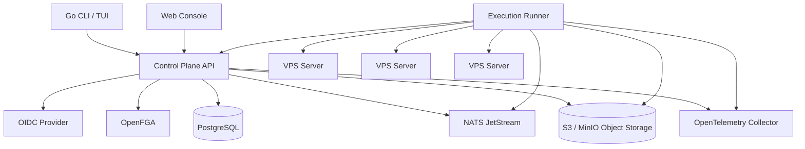
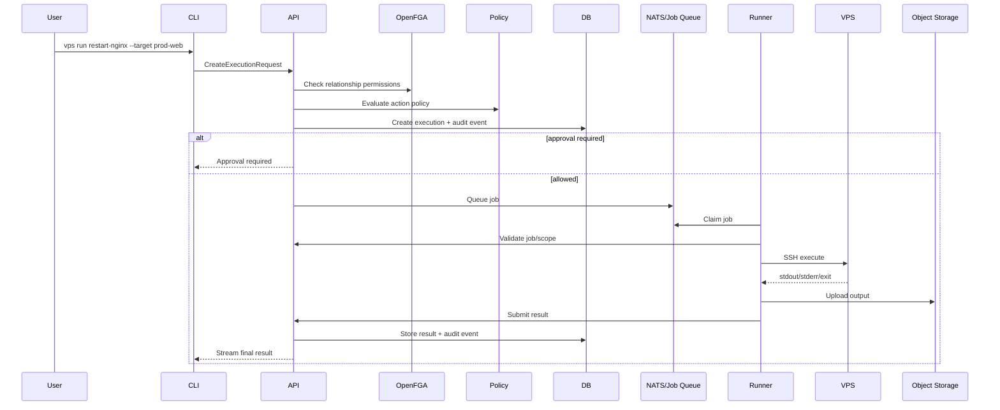

# Technical Specification: VPS Tools

**Working title:** VPS Tools  
**Document status:** Draft v1  
**Date:** 18 May 2026  
**Related document:** Product Requirements Document: VPS Tools  
**Primary audience:** Engineering, architecture, security, DevOps, product  

---

## 1. Purpose

This technical specification translates the VPS Tools PRD into a buildable architecture and implementation plan.

The product is a hybrid SaaS and self-hosted platform for managing VPS fleets through a secure CLI/TUI, with controlled execution, delegated runbooks, RBAC, approvals, and audit trails.

The technical direction is:

> Build the VPS Tools domain, policy orchestration, audit semantics, runner model, and user experience ourselves; reuse mature open-source components everywhere else.

The product should avoid reinventing existing infrastructure primitives such as terminal UI components, identity, message queues, object storage, telemetry, database tooling, and authorisation engines where credible open-source options exist.

---

## 2. Architecture Summary

### 2.1 Recommended Stack

| Layer | Recommended technology | Rationale |
|---|---|---|
| CLI/TUI language | Go | Single static binaries, strong networking libraries, excellent CLI ecosystem, good cross-platform support |
| CLI command framework | Cobra | Mature Go CLI command tree, help, flags, completions, docs generation |
| TUI framework | Charm Bubble Tea | Robust terminal UI architecture using Elm-style update loop |
| TUI components | Charm Bubbles | Reusable terminal components |
| TUI forms | Charm Huh | Interactive forms for onboarding, approvals, server registration, runbook creation |
| Terminal styling/layout | Charm Lip Gloss | Consistent styling, layout, borders, tables, panels |
| Markdown rendering | Charm Glamour | Render runbook docs, explanations, and audit notes in terminal |
| CLI config | Viper + OS keyring | Config files/env vars plus secure token storage |
| API | Go + ConnectRPC + Protocol Buffers | Type-safe APIs usable by CLI, web console, and future SDKs |
| Web console | Next.js + TypeScript | Rich admin console, approvals, audit browser, inventory, reporting |
| Database | PostgreSQL | Strong relational model, JSONB support, mature operational footprint |
| SQL access | sqlc + pgx | Type-safe SQL without heavy ORM magic |
| Migrations | Goose or Atlas | Repeatable database migrations |
| Job/event backbone | NATS JetStream | Lightweight durable messaging suitable for hybrid runner architecture |
| Object storage | S3-compatible storage, MinIO for self-hosted | Store execution logs, exports, session recordings, artefacts |
| Relationship authorisation | OpenFGA | Fine-grained org/project/server/runbook relationships |
| Policy engine | Internal MVP policy evaluator, OPA post-MVP | Avoid policy complexity early; enable policy-as-code later |
| Identity | OIDC-first; Zitadel/Keycloak supported for self-hosted | Avoid building full IAM; support external identity providers |
| Telemetry | OpenTelemetry | Vendor-neutral traces, metrics, logs |
| Metrics | Prometheus-compatible metrics | Self-hosted friendly and widely supported |
| Logs | Structured JSON logs with slog/zerolog/zap | Searchable, machine-readable operational logs |
| Packaging | Docker, Docker Compose, GoReleaser | Simple open-source install and cross-platform binary releases |
| Security scanning | Trivy, govulncheck, osv-scanner | Avoid bespoke supply-chain scanning |
| SBOM/signing | Syft, Cosign | Supply-chain evidence and signed artefacts |

### 2.2 High-Level System Diagram



### 2.3 Core Design Principle

The control plane decides whether work is allowed. The runner performs work. The audit system records what happened.

No runner should be allowed to invent authority locally. No CLI should be trusted as a policy enforcement point. No privileged action should happen without a control-plane decision and an audit event.

---

## 3. Deployment Modes

VPS Tools must support three deployment modes from the start.

### 3.1 Hosted SaaS

The SaaS deployment hosts:

- Control plane API.
- Web console.
- PostgreSQL.
- NATS JetStream.
- Object storage.
- OpenFGA.
- Telemetry pipeline.
- Billing/licensing services.

Customer options:

- Use SaaS-hosted runner for public reachable servers where acceptable.
- Deploy customer-managed runner inside their own network.
- Connect runner outbound to the control plane.

### 3.2 Self-Hosted Open-Source Base

The open-source base deployment should use Docker Compose first.

Minimum services:

- API.
- Web console.
- PostgreSQL.
- NATS JetStream.
- MinIO or local object storage.
- OpenFGA.
- Runner.
- Optional local OIDC provider profile.

The open-source edition should be genuinely useful, not a demo. It should support unlimited users, core CLI, inventory, basic execution, basic runbooks, basic RBAC, and basic audit.

### 3.3 Self-Hosted Supported Commercial

The supported edition should support production deployment patterns:

- Docker Compose for small deployments.
- Helm chart post-MVP.
- External PostgreSQL.
- External S3-compatible object storage.
- External NATS cluster.
- External OIDC provider.
- External telemetry/logging.
- Backup/restore documentation.
- Upgrade tooling.
- Optional HA architecture.

---

## 4. Repository Strategy

### 4.1 Recommended Repository Layout

Use a monorepo at the start.

```text
vps-tools/
  apps/
    cli/                  # Go CLI/TUI binary: vps
    api/                  # Go control plane API
    runner/               # Go execution runner
    web/                  # Next.js web console
    worker/               # Optional background worker if split from API
  packages/
    proto/                # Protocol Buffer schemas
    sdk-go/               # Generated and hand-written Go SDK helpers
    sdk-ts/               # Generated TypeScript SDK/client wrappers
    authz/                # Shared authorisation models/helpers
    audit/                # Shared audit event definitions
    runbooks/             # Runbook schema and validator
    sshx/                 # SSH execution/session helper package
  deploy/
    docker-compose/
    helm/
    systemd/
  migrations/
    postgres/
  docs/
    adr/
    operator-guide/
    developer-guide/
    api/
  scripts/
  .github/
```

### 4.2 Why Monorepo First

A monorepo keeps early product velocity high:

- Shared protobuf schemas.
- Shared audit event definitions.
- Shared runbook schema.
- Shared test fixtures.
- Easier cross-component refactors.
- Easier local development environment.

Split repositories later only if release, licensing, or team boundaries demand it.

---

## 5. Component Specifications

## 5.1 CLI/TUI Application

### 5.1.1 Purpose

The CLI is the primary operational interface. It must work well in both scripted/headless and interactive TUI modes.

The TUI should not be cosmetic. It should materially improve workflows such as:

- Server selection.
- Runbook execution.
- Approval review.
- Audit search.
- Execution monitoring.
- Onboarding and setup.
- Error recovery.

### 5.1.2 Technology

Recommended stack:

- Go.
- Cobra for command structure.
- Charm Bubble Tea for TUI state and rendering.
- Charm Bubbles for reusable widgets.
- Charm Huh for forms.
- Charm Lip Gloss for styling.
- Charm Glamour for Markdown rendering.
- Viper for configuration.
- OS keyring for credential/token storage.

### 5.1.3 CLI Modes

The CLI should support three modes:

#### A. Direct command mode

For fast, scriptable operations:

```bash
vps server list --tag env=prod --output table
vps exec group:staging-web -- df -h
vps run restart-nginx --target server:web-01 --reason "Recovering from 502s"
```

#### B. Interactive TUI mode

For guided operations:

```bash
vps tui
vps server browse
vps approvals
vps audit
```

#### C. Machine-readable mode

For automation:

```bash
vps server list --output json
vps audit search --since 2026-05-01 --output json
```

### 5.1.4 TUI Screens

MVP TUI screens:

1. **Home / Command Palette**
   - Recent servers.
   - Recent executions.
   - Pending approvals.
   - Quick actions.

2. **Server Browser**
   - Search/filter servers.
   - Filter by tags, environment, role, provider, customer/project.
   - Inspect selected server.
   - Launch permitted actions.

3. **Runbook Launcher**
   - List permitted runbooks.
   - Show risk level and required role.
   - Select targets.
   - Fill parameters using forms.
   - Show command preview where allowed.
   - Submit execution or approval request.

4. **Execution Monitor**
   - Real-time progress.
   - Per-server status.
   - Output stream.
   - Failed target list.
   - Retry permitted failures where policy allows.

5. **Approval Queue**
   - Pending approvals.
   - Requester, target, command/runbook, risk, reason.
   - Approve/deny with notes.

6. **Audit Browser**
   - Search by actor, target, action, result, date range.
   - View event details.
   - View linked execution output.
   - Export where authorised.

7. **Setup Wizard**
   - Login.
   - Select organisation.
   - Add first server.
   - Validate SSH.
   - Run first health check.

### 5.1.5 CLI Configuration

Configuration locations should follow platform conventions:

```text
Linux:   ~/.config/vps-tools/config.yaml
macOS:   ~/Library/Application Support/vps-tools/config.yaml
Windows: %AppData%\vps-tools\config.yaml
```

Sensitive values should not be stored in config files unless explicitly configured for non-production/dev mode.

Token storage priority:

1. OS keychain/keyring.
2. Encrypted local file using OS-protected key material.
3. Plain local file only for development, with explicit warning.

### 5.1.6 CLI Command Tree

```text
vps
  login
  logout
  whoami
  tui
  org
    list
    switch
  server
    add
    import
    list
    inspect
    check
    tags
    browse
  group
    create
    list
    inspect
  ssh
  exec
  run
  runbook
    list
    inspect
    validate
    create
    edit
    publish
  service
    status
    restart
    reload
    logs
  updates
    check
    apply
  access
    request
    list
  approvals
    list
    approve
    deny
  audit
    search
    show
    export
  runner
    register
    list
    status
  config
    get
    set
    path
```

### 5.1.7 CLI/TUI Non-Negotiables

- Every command must support `--help`.
- Risky commands must show clear confirmation prompts.
- Production actions must show target count, environment, command/runbook, and reason before proceeding.
- All long-running operations must stream progress.
- TUI must degrade gracefully in dumb terminals.
- Headless JSON output must be stable and documented.
- No secrets in debug output.

---

## 5.2 Web Console

### 5.2.1 Purpose

The web console is for administration, review, approvals, audit, reporting, and onboarding. It should not replace the CLI as the primary operational interface.

### 5.2.2 Recommended Stack

- Next.js.
- TypeScript.
- Tailwind CSS.
- Connect-Web generated client from protobuf schemas.
- Server-side rendering where useful.
- Component library selected later; avoid heavy dependency before UX is clear.

### 5.2.3 MVP Web Features

- Login/OIDC callback.
- Organisation switcher.
- User invitation and role assignment.
- Server inventory view.
- Server detail view.
- Runner registration status.
- Runbook list/create/edit/publish.
- Approval queue.
- Audit search/detail/export.
- Basic settings.

### 5.2.4 Web Console Security

- Same API authorisation as CLI.
- No web-only bypasses.
- CSRF protection where cookies are used.
- Short session lifetime for privileged users.
- MFA enforced by identity provider/policy.
- Audit every privileged web action.

---

## 5.3 Control Plane API

### 5.3.1 Purpose

The control plane is the source of truth for:

- Organisations.
- Users and memberships.
- Server inventory.
- Server groups.
- Runbooks.
- Policies.
- Approvals.
- Execution lifecycle.
- Audit events.
- Runner registration.
- Licences/plans.

### 5.3.2 Recommended API Style

Use ConnectRPC with Protocol Buffers.

Reasons:

- Type-safe clients.
- Shared schemas across CLI, runner, and web.
- Supports browser clients.
- Supports streaming patterns needed for execution progress.
- Easier SDK generation later.

### 5.3.3 API Service Groups

```text
AuthService
OrganisationService
MembershipService
ServerService
GroupService
RunbookService
PolicyService
ApprovalService
ExecutionService
AuditService
RunnerService
NotificationService
LicenceService
```

### 5.3.4 API Principles

- API is the policy enforcement point.
- Every mutating endpoint must create audit events.
- Every endpoint must include organisation context.
- Use idempotency keys for mutating operations that may be retried.
- Avoid leaking cross-tenant identifiers.
- All list endpoints must support pagination.
- All search endpoints must be bounded and index-backed.

---

## 5.4 Runner

### 5.4.1 Purpose

The runner executes approved jobs against target VPS servers. It is the component that needs network reachability to the servers.

The runner can be:

- SaaS-hosted.
- Customer-managed for SaaS customers.
- Local/self-hosted in open-source or supported deployments.

### 5.4.2 Runner Responsibilities

- Register with control plane.
- Maintain secure outbound connection to control plane/NATS.
- Claim authorised jobs.
- Validate job signature and runner scope.
- Connect to target server via SSH.
- Execute command/runbook step.
- Stream progress and output.
- Enforce timeout.
- Enforce concurrency limits.
- Redact configured output patterns before storage/display where possible.
- Upload logs to object storage.
- Emit execution result events.
- Emit runner telemetry.

### 5.4.3 Runner Non-Responsibilities

The runner must not:

- Decide user authorisation by itself.
- Accept arbitrary unauthorised commands from CLI.
- Store long-lived user credentials.
- Modify audit history.
- Invent server inventory.
- Execute jobs from unknown organisations.

### 5.4.4 Runner Registration

Registration flow:

1. Admin creates runner registration token.
2. Token has organisation, scope, expiry, and allowed network/metadata.
3. Runner starts with token.
4. Runner exchanges token for runner identity certificate/key.
5. Control plane records runner metadata.
6. Runner begins heartbeat.
7. Runner receives jobs only for authorised scopes.

### 5.4.5 Runner Connectivity Model

For MVP, use outbound-only connectivity from runner to control plane.

Recommended progression:

#### MVP

- Runner establishes authenticated HTTPS/Connect stream to control plane.
- Runner receives job notifications or polls for work.
- Runner streams execution events back over HTTPS.

#### Phase 2

- NATS JetStream used as durable event/job backbone.
- Runner authenticates to scoped NATS subjects.
- Execution events flow through durable streams.

#### Phase 3

- NATS leaf nodes or regional brokers for scale and private networks.
- Runner groups and execution regions.

### 5.4.6 Runner Job State Machine

```text
created
  -> policy_denied
  -> awaiting_approval
  -> approval_denied
  -> approval_expired
  -> queued
  -> claimed
  -> running
  -> succeeded
  -> partial_failed
  -> failed
  -> cancelled
  -> timed_out
```

Every state transition must create an audit or execution event.

---

## 5.5 SSH and Server Access

### 5.5.1 MVP Access Strategy

MVP should support agentless SSH execution first.

Recommended MVP approach:

- Runner holds server access credentials, encrypted at rest.
- Credentials are scoped to runner/server group.
- SSH host keys are verified and pinned where possible.
- The control plane authorises each execution before runner receives it.
- The runner logs metadata, stdout, stderr, exit code, and timing.

This is simpler to ship but not the end-state security model.

### 5.5.2 Preferred Security Direction

Move toward short-lived SSH certificates.

Target model:

- Organisation has an SSH CA.
- Servers trust the organisation/user/runner CA.
- Control plane signs short-lived certs after policy approval.
- Certs contain principal, role, target scope, expiry, and reason metadata where feasible.
- Runner or CLI uses cert only for approved action/session.
- Long-lived shared private keys are phased out.

### 5.5.3 SSH Execution Implementation

Non-interactive command execution:

- Use Go SSH library for controlled execution.
- Capture stdout/stderr separately.
- Set command timeout.
- Avoid shell where possible for simple commands.
- Use explicit shell invocation only where required by runbook.

Interactive sessions:

- MVP may record only session metadata.
- Full recording can be post-MVP.
- For `vps ssh`, consider launching native OpenSSH client after authorisation where technically simpler.
- Long-term, proxy interactive sessions through runner/control plane for recording and policy enforcement.

### 5.5.4 Server Bootstrap

Bootstrap options:

#### Simple bootstrap

```bash
curl -fsSL https://install.vpstools.example/bootstrap.sh | sudo bash
```

The script should:

- Create restricted service user.
- Install authorised key or trusted SSH CA.
- Configure minimal sudoers permissions.
- Capture host fingerprint.
- Register server metadata.

#### Manual bootstrap

For security-conscious users:

- Provide commands line-by-line.
- Document created users, files, permissions, and sudoers entries.
- Allow review before execution.

### 5.5.5 Sudo Strategy

Avoid blanket passwordless root where possible.

Options:

1. Restricted sudoers rules for approved commands.
2. Runbook-specific command wrappers.
3. Privileged runner user with policy-controlled execution.
4. Short-lived sudo elevation post-MVP.

MVP can start with a pragmatic service user model but must document risk clearly.

---

## 5.6 Authorisation and Policy

### 5.6.1 Layered Authorisation Model

Use a layered model:

1. Authentication: who is the actor?
2. Organisation membership: does the actor belong to this org?
3. Relationship authorisation: is the actor related to the target/resource in a way that grants base permission?
4. Policy evaluation: is this action allowed under environment, role, risk, time, approval, and target conditions?
5. Approval state: is approval required and present?
6. Execution guardrails: concurrency, confirmation, maintenance windows, blocklists.

### 5.6.2 OpenFGA Usage

OpenFGA should model relationships such as:

- User is owner/admin/senior/junior/auditor of organisation.
- User belongs to team.
- Team has access to project/client.
- Project contains server group.
- Server group contains server.
- Runbook is permitted for team/role/environment.
- User can view/execute/approve/audit resource.

Example conceptual model:

```text
type user

type organisation
  relations
    define owner: [user]
    define admin: [user]
    define senior_engineer: [user]
    define junior_engineer: [user]
    define auditor: [user]
    define can_manage: owner or admin
    define can_audit: owner or admin or auditor

type server
  relations
    define parent_org: [organisation]
    define operator: [user, team#member]
    define viewer: [user, team#member]
    define can_view: viewer or operator or parent_org->admin or parent_org->owner
    define can_operate: operator or parent_org->senior_engineer or parent_org->admin or parent_org->owner

type runbook
  relations
    define parent_org: [organisation]
    define executor: [user, team#member]
    define approver: [user, team#member]
    define can_execute: executor or parent_org->senior_engineer or parent_org->admin or parent_org->owner
    define can_approve: approver or parent_org->admin or parent_org->owner
```

### 5.6.3 Policy Evaluation

MVP policy evaluator can be implemented in the application using structured policy documents.

Example policy:

```yaml
id: prod-restart-approval
name: Production service restart requires approval
match:
  action: service.restart
  environment: production
risk: medium
rules:
  require_reason: true
  require_approval: true
  approver_roles:
    - senior_engineer
    - admin
  max_targets_without_extra_confirmation: 3
  allowed_hours:
    timezone: Europe/Dublin
    windows:
      - days: [mon, tue, wed, thu]
        start: "09:00"
        end: "17:30"
```

Post-MVP, consider OPA for policy-as-code once policy requirements become complex enough to justify the operational overhead.

### 5.6.4 Enforcement Points

Policy checks must happen at:

- API command submission.
- Approval decision.
- Runner job claim.
- Job execution start.
- Sensitive output export.
- Audit export.

The runner should verify job signatures and scope, but not make primary access decisions.

---

## 5.7 Runbook Engine

### 5.7.1 Runbook Format

Use YAML for human-editable runbooks.

Runbook schema should be formally validated.

Example:

```yaml
apiVersion: vpstools.io/v1
kind: Runbook
metadata:
  name: restart-nginx
  title: Restart Nginx
  description: Restart Nginx and show service status
  risk: medium
  tags:
    - nginx
    - service
spec:
  parameters:
    - name: service
      type: string
      default: nginx
      allowedValues: [nginx]
  targets:
    allowedTags:
      role: web
    allowedEnvironments:
      - staging
      - production
  approval:
    rules:
      - when:
          environment: production
        required: true
  execution:
    shell: bash
    sudo: true
    timeoutSeconds: 60
    concurrency: 5
    command: |
      systemctl restart {{ .params.service }}
      systemctl status {{ .params.service }} --no-pager
  output:
    store: full
    redact:
      - secret
      - token
      - password
  rollback:
    notes: |
      If restart fails, inspect journalctl and nginx config using nginx -t.
```

### 5.7.2 Runbook Safety

Runbook execution must include:

- Schema validation.
- Parameter validation.
- Target validation.
- Policy evaluation.
- Approval check.
- Command preview where allowed.
- Audit event before execution.
- Execution result after completion.

### 5.7.3 Templating

Use a deliberately limited templating model.

Avoid arbitrary code execution inside templates. Use safe parameter substitution and explicit helper functions only.

Unsafe:

```yaml
command: "{{ exec .params.anything }}"
```

Safe:

```yaml
command: "systemctl status {{ shellquote .params.service }} --no-pager"
```

### 5.7.4 Runbook Versioning

Runbooks should be immutable once published.

Editing a runbook creates a new version:

```text
restart-nginx@v1
restart-nginx@v2
restart-nginx@v3
```

Executions must reference the exact runbook version used.

---

## 5.8 Execution Engine

### 5.8.1 Execution Types

MVP execution types:

- Raw command execution for authorised senior roles.
- Runbook execution.
- Built-in operation execution, such as service status or updates check.
- Health check execution.

### 5.8.2 Execution Request Flow



### 5.8.3 Concurrency and Safety

Execution must support:

- Per-organisation concurrency limits.
- Per-runner concurrency limits.
- Per-target concurrency locks.
- Per-environment safeguards.
- Canary execution.
- Batch/wave execution.
- Timeouts.
- Cancellation.

Example default limits:

| Limit | MVP default |
|---|---:|
| Max concurrent jobs per runner | 10 |
| Max concurrent targets per execution | 20 |
| Max concurrent production targets without explicit confirmation | 3 |
| Max command duration | 300 seconds |
| Max stored output per target | 5 MB |

### 5.8.4 Output Handling

Execution output should be treated as sensitive.

Rules:

- Store stdout/stderr separately.
- Redact common secret patterns before display.
- Store original output only where policy permits.
- Restrict access to outputs by role and target permission.
- Retain outputs based on plan and policy.
- Link output to execution and audit event.

---

## 5.9 Audit System

### 5.9.1 Purpose

The audit system is a primary product feature, not logging glue.

It must answer:

- Who did what?
- To which server/group/runbook/policy?
- When?
- From where?
- Why?
- Was it approved?
- What was the result?
- What changed?

### 5.9.2 Audit Event Model

```json
{
  "event_id": "evt_01h...",
  "organisation_id": "org_01h...",
  "timestamp": "2026-05-18T15:24:00Z",
  "actor": {
    "type": "user",
    "id": "usr_01h...",
    "email": "jane@example.com",
    "role_at_time": "junior_engineer"
  },
  "source": {
    "ip": "203.0.113.10",
    "user_agent": "vps-cli/0.1.0",
    "device_id": "dev_01h..."
  },
  "action": "execution.create",
  "target": {
    "type": "server_group",
    "id": "grp_01h...",
    "name": "prod-web"
  },
  "environment": "production",
  "reason": "Investigating elevated 5xx rate",
  "approval_id": "apr_01h...",
  "result": "queued",
  "metadata": {
    "runbook": "restart-nginx@v2",
    "risk": "medium",
    "target_count": 3
  },
  "prev_hash": "...",
  "event_hash": "..."
}
```

### 5.9.3 Audit Storage

Use PostgreSQL for indexed audit metadata and object storage for large artefacts.

Audit table design principles:

- Append-only at application level.
- No update/delete privileges for normal app role.
- Separate privileged maintenance role.
- Hash chain for tamper evidence where practical.
- Partition by organisation and time if required at scale.

### 5.9.4 Audit Search

Index by:

- organisation_id.
- timestamp.
- actor_id.
- action.
- target_type.
- target_id.
- environment.
- result.
- approval_id.
- execution_id.

### 5.9.5 Audit Exports

Exports should support:

- JSONL.
- CSV for simple review.
- Signed archive with checksum.
- Date range and filter criteria.
- Export audit event recording the export.

---

## 5.10 Data Storage

### 5.10.1 PostgreSQL

Primary database tables:

```text
organisations
users
memberships
teams
team_memberships
servers
server_tags
server_groups
server_group_memberships
runners
runner_scopes
runbooks
runbook_versions
policies
approval_requests
executions
execution_targets
execution_events
audit_events
api_tokens
licences
billing_accounts
notifications
```

### 5.10.2 Object Storage

Object storage paths:

```text
org/{org_id}/executions/{execution_id}/{target_id}/stdout.log
org/{org_id}/executions/{execution_id}/{target_id}/stderr.log
org/{org_id}/sessions/{session_id}/recording.cast
org/{org_id}/exports/audit/{export_id}.jsonl.gz
org/{org_id}/diagnostics/{bundle_id}.tar.gz
```

### 5.10.3 Encryption

- Encrypt sensitive DB fields at application level where useful.
- Use disk/database encryption provided by infrastructure where available.
- Object storage should use server-side encryption where available.
- SaaS should use cloud KMS.
- Self-hosted should support configured master key or external Vault/KMS.

---

## 5.11 Identity and Authentication

### 5.11.1 Principle

Do not build a full identity provider.

Use OIDC as the primary production authentication model.

### 5.11.2 SaaS

SaaS should support:

- Email/password or magic-link onboarding if using a managed auth provider.
- MFA for privileged roles.
- Google Workspace OIDC.
- Microsoft Entra ID OIDC.
- Generic OIDC.
- SAML post-MVP or enterprise only.

### 5.11.3 Self-Hosted

Self-hosted should support:

- Generic OIDC.
- Keycloak.
- Zitadel.
- Microsoft Entra ID.
- Google Workspace.
- Okta/Auth0 where customers already use them.

For local development and small open-source installs, provide a bootstrap admin flow. Production documentation should strongly recommend OIDC.

### 5.11.4 CLI Login

CLI login should use:

- Browser-based OIDC authorisation code with PKCE.
- Device code flow where browser callback is not practical.
- Short-lived access token.
- Refresh token stored in OS keyring where allowed.
- Organisation selection after login.

---

## 5.12 Licensing and Edition Control

### 5.12.1 Open-Core Architecture

The codebase should make edition boundaries explicit without making the open-source edition painful to work with.

Suggested package boundary:

```text
packages/core/        # Open-source base functionality
packages/enterprise/  # Supported/commercial-only extensions
```

Open-source should include:

- CLI.
- Runner.
- Core API.
- Inventory.
- Basic RBAC.
- Basic runbooks.
- Basic audit.
- Docker Compose deployment.

Commercial extensions may include:

- Advanced RBAC/policy.
- Advanced approvals.
- SSO convenience integrations.
- Advanced audit retention/export.
- Terminal session recording.
- SIEM integrations.
- MSP multi-client features.
- HA deployment tooling.
- Support/licensing management.

### 5.12.2 Licence Choice

This requires legal review.

Technical recommendation:

- CLI and SDKs: permissive licence to encourage adoption.
- Server/control plane: consider a copyleft licence if SaaS competition risk matters.
- Commercial modules: proprietary or source-available depending on business strategy.

Do not finalise licensing without legal advice.

---

## 6. API Design

### 6.1 Example Protobuf Services

```proto
syntax = "proto3";

package vpstools.v1;

service ServerService {
  rpc AddServer(AddServerRequest) returns (AddServerResponse);
  rpc ListServers(ListServersRequest) returns (ListServersResponse);
  rpc GetServer(GetServerRequest) returns (GetServerResponse);
  rpc CheckServer(CheckServerRequest) returns (CheckServerResponse);
}

service ExecutionService {
  rpc CreateExecution(CreateExecutionRequest) returns (CreateExecutionResponse);
  rpc GetExecution(GetExecutionRequest) returns (GetExecutionResponse);
  rpc StreamExecution(StreamExecutionRequest) returns (stream ExecutionEvent);
  rpc CancelExecution(CancelExecutionRequest) returns (CancelExecutionResponse);
}

service ApprovalService {
  rpc ListApprovals(ListApprovalsRequest) returns (ListApprovalsResponse);
  rpc Approve(ApproveRequest) returns (ApproveResponse);
  rpc Deny(DenyRequest) returns (DenyResponse);
}

service AuditService {
  rpc SearchAuditEvents(SearchAuditEventsRequest) returns (SearchAuditEventsResponse);
  rpc GetAuditEvent(GetAuditEventRequest) returns (GetAuditEventResponse);
  rpc ExportAuditEvents(ExportAuditEventsRequest) returns (ExportAuditEventsResponse);
}
```

### 6.2 API Error Model

Use structured errors.

Examples:

```json
{
  "code": "POLICY_DENIED",
  "message": "Production service restart requires approval.",
  "details": {
    "required_action": "request_approval",
    "policy_id": "prod-restart-approval",
    "target": "server:web-01"
  }
}
```

Common error codes:

```text
UNAUTHENTICATED
FORBIDDEN
POLICY_DENIED
APPROVAL_REQUIRED
APPROVAL_EXPIRED
TARGET_NOT_FOUND
RUNBOOK_INVALID
RUNNER_UNAVAILABLE
EXECUTION_TIMEOUT
OUTPUT_REDACTED
RATE_LIMITED
```

---

## 7. Local Development Environment

### 7.1 Developer Prerequisites

- Go.
- Node.js.
- Docker.
- Docker Compose.
- make or task runner.
- PostgreSQL client.
- NATS CLI optional.

### 7.2 Local Stack

```text
PostgreSQL
NATS JetStream
MinIO
OpenFGA
API
Runner
Web console
Optional local OIDC provider
```

### 7.3 One-Command Dev Bootstrap

```bash
make dev-up
make migrate
make seed
make cli
```

Expected result:

- Local control plane running.
- Local runner registered.
- Demo organisation created.
- Demo users created.
- Demo servers represented by local containers.
- CLI can run demo health check.

---

## 8. Security Specification

### 8.1 Threats to Design Against

- Junior user executes unauthorised production command.
- Senior user accidentally targets too many production servers.
- Stolen CLI token.
- Compromised runner.
- Cross-tenant data leakage.
- Malicious runbook change.
- Audit tampering.
- Secret leakage through command output.
- SSH host key spoofing.
- Replay of old execution job.
- Privilege escalation through command parameters.

### 8.2 Security Controls

| Threat | Control |
|---|---|
| Unauthorised execution | API-side policy enforcement, OpenFGA checks, runner job signature validation |
| Accidental broad production action | Confirmation, target count warning, concurrency limits, approval rules |
| Stolen CLI token | Short-lived access tokens, refresh token in OS keyring, revocation, MFA |
| Compromised runner | Runner scopes, outbound auth, job signing, no policy authority in runner |
| Cross-tenant leakage | Organisation scoping, DB constraints, integration tests, tenant-aware indexes |
| Malicious runbook change | Versioning, approvals, audit events, role restrictions |
| Audit tampering | Append-only app role, hash chaining, export checksums |
| Secret leakage | Output redaction, restricted output access, secret pattern registry |
| SSH host spoofing | Host key pinning, changed host warning, bootstrap verification |
| Replay attack | Job expiry, nonce/idempotency key, signed job payload |
| Parameter injection | Strict schema validation, shell quoting, limited templating |

### 8.3 Secrets

Secret classes:

- API signing keys.
- OIDC client secrets.
- Runner credentials.
- SSH private keys.
- SSH CA keys.
- Webhook secrets.
- Object storage credentials.
- Database credentials.

Rules:

- No secrets in Git.
- No secrets in audit command preview.
- No secrets in CLI debug logs.
- Support external secret manager post-MVP.
- SaaS production secrets should use cloud KMS/secret manager.
- Self-hosted secrets should be provided through environment variables, mounted files, or external secret manager.

---

## 9. Observability

### 9.1 Telemetry Signals

Use OpenTelemetry for:

- API traces.
- Runner traces.
- Execution lifecycle spans.
- Queue/job processing spans.
- Database timing.
- External provider calls.

Use metrics for:

- API request count/duration/error rate.
- Execution count/duration/result.
- Runner heartbeat age.
- Runner job failures.
- Queue depth.
- Audit ingestion failures.
- Policy denials.
- Approval latency.
- Object storage upload failures.

Use structured logs for:

- API requests.
- Auth failures.
- Policy decisions.
- Runner lifecycle.
- Job claims.
- Execution failures.
- Audit write failures.

### 9.2 Self-Hosted Observability

Open-source self-hosted should expose:

- `/metrics` Prometheus endpoint.
- Health endpoints.
- JSON logs to stdout.
- Optional OpenTelemetry collector profile in Docker Compose.

### 9.3 SaaS Observability

SaaS should add:

- Per-tenant operational metrics.
- Error budget tracking.
- Alerting on runner connectivity issues.
- Alerting on audit write failures.
- Security alerts for suspicious access patterns.

---

## 10. Testing Strategy

### 10.1 Test Types

| Test type | Purpose |
|---|---|
| Unit tests | Validate domain logic, policy rules, runbook validation |
| Integration tests | API + DB + OpenFGA + NATS + object storage |
| CLI snapshot tests | Ensure command output stability |
| TUI model tests | Test Bubble Tea update logic without real terminal |
| Runner tests | Validate SSH execution, timeouts, output capture |
| Security tests | Token handling, authorisation bypass attempts, tenant isolation |
| Contract tests | Protobuf/API compatibility |
| Migration tests | DB migrations up/down and compatibility |
| End-to-end tests | Full workflow from login to execution to audit |

### 10.2 Demo VPS Test Harness

Use local containers as fake VPS targets for automated tests.

Example:

```text
ubuntu-2204-ssh
ubuntu-2404-ssh
debian-12-ssh
broken-ssh
slow-command-target
large-output-target
```

### 10.3 Critical Test Cases

- Junior cannot execute arbitrary production command.
- Junior can execute allowed staging runbook.
- Production runbook requires approval.
- Approval expires and execution is blocked.
- Removed user cannot continue using CLI refresh token.
- Runner cannot claim job outside its scope.
- Execution output is linked to audit event.
- Runbook parameter injection attempt is blocked.
- Cross-organisation server access is impossible.
- Audit event cannot be updated by app role.

---

## 11. Build, Release, and Supply Chain

### 11.1 CLI Release

Use GoReleaser to produce:

- Linux amd64/arm64.
- macOS amd64/arm64.
- Windows amd64.
- Checksums.
- Signed binaries.
- Homebrew tap post-MVP.
- Debian/RPM packages post-MVP.

### 11.2 Container Release

Images:

```text
vpstools/api
vpstools/web
vpstools/runner
vpstools/openfga-migrations
vpstools/migrate
```

Image requirements:

- Minimal base image.
- Non-root user.
- SBOM generated.
- Vulnerability scan in CI.
- Signed images.
- Versioned tags and immutable digest references.

### 11.3 Versioning

Use semantic versioning.

```text
v0.x: pre-stable beta
v1.0: stable API and self-hosted upgrade contract
```

Track compatibility for:

- CLI to API.
- Runner to API.
- DB schema migrations.
- Runbook schema versions.
- Protobuf API versions.

---

## 12. MVP Implementation Phases

### Phase 0: Architecture Spike

Goal: validate technical choices before committing.

Deliverables:

- Go CLI proof of concept with Cobra and Bubble Tea.
- ConnectRPC API proof of concept.
- Runner connects to API and executes `uptime` over SSH.
- PostgreSQL schema skeleton.
- Audit event written for execution.
- Docker Compose local environment.

### Phase 1: Foundations

Deliverables:

- Monorepo setup.
- CI pipeline.
- Protobuf service definitions.
- API skeleton.
- CLI skeleton.
- Web console skeleton.
- PostgreSQL migrations.
- Docker Compose dev stack.
- Basic auth/login flow.
- Organisation model.
- Audit event framework.

### Phase 2: Inventory and Runner

Deliverables:

- Add/list/inspect servers.
- Server tags and groups.
- Runner registration.
- Runner heartbeat.
- Basic SSH connectivity check.
- Server health check.
- CSV import.

### Phase 3: Execution Engine

Deliverables:

- Single-server execution.
- Group execution.
- Execution status model.
- Output capture.
- Object storage integration.
- Execution streaming to CLI.
- Timeouts and cancellation.
- Per-target result view.

### Phase 4: RBAC, Policy, and Approvals

Deliverables:

- OpenFGA integration.
- Role and relationship model.
- Application policy evaluator.
- Approval request lifecycle.
- CLI approval commands.
- Web approval queue.
- Denial messages with next steps.

### Phase 5: Runbooks

Deliverables:

- Runbook YAML schema.
- Runbook validation.
- Runbook versioning.
- Runbook execution.
- Parameter forms in TUI.
- Target constraints.
- Approval integration.
- Runbook audit history.

### Phase 6: TUI Polish and Admin Console

Deliverables:

- Server browser.
- Runbook launcher.
- Execution monitor.
- Approval queue.
- Audit browser.
- Setup wizard.
- Web console inventory, users, approvals, audit.

### Phase 7: Hardening and Beta

Deliverables:

- MFA/OIDC hardening.
- Token revocation.
- Runner scope hardening.
- Output redaction.
- Audit export.
- Security review.
- Documentation.
- First beta deployment.

---

## 13. Build vs Reuse Decisions

### 13.1 Build Ourselves

Build these because they are core product differentiation:

- VPS inventory domain model.
- Server grouping and targeting model.
- Delegated runbook model.
- Execution orchestration semantics.
- Approval workflow semantics.
- Audit event schema and UX.
- CLI/TUI workflows.
- Runner protocol and scoping.
- Edition boundary logic.
- SaaS billing/seat enforcement.

### 13.2 Reuse Open Source

Reuse these because they are infrastructure primitives:

- Terminal UI framework.
- CLI command parsing.
- Identity provider/OIDC.
- Relationship authorisation backend.
- Database.
- Queue/event backbone.
- Object storage.
- Telemetry.
- Metrics/logging pipeline.
- SQL generation.
- Container tooling.
- Security scanning.
- SBOM/signing tooling.

---

## 14. Architecture Decision Records to Create

Create ADRs for:

1. Go as primary backend/CLI/runner language.
2. Charm Bubble Tea ecosystem for TUI.
3. Cobra for command framework.
4. ConnectRPC and protobuf for API.
5. PostgreSQL as primary database.
6. sqlc over ORM.
7. NATS JetStream for jobs/events.
8. OpenFGA for relationship authorisation.
9. Internal policy evaluator before OPA.
10. OIDC-first authentication.
11. Agentless SSH first.
12. Short-lived SSH certs as target model.
13. Docker Compose as first self-hosted deployment.
14. S3-compatible object storage.
15. OpenTelemetry for observability.
16. Monorepo first.

---

## 15. Open Technical Questions

1. Should the MVP include full interactive SSH sessions, or only controlled command/runbook execution?
2. Should terminal session recording be in MVP or supported-edition post-MVP?
3. Should OpenFGA be mandatory in open-source self-hosted, or should small installs support embedded/simple mode?
4. Should the default self-hosted OIDC provider be Zitadel, Keycloak, or external-only?
5. Should the first runner communication model use HTTPS streaming only, or NATS JetStream directly?
6. Should raw command execution be restricted to senior engineers only, even in open-source?
7. What is the safest default server bootstrap model?
8. How much of SSH CA support should ship in MVP?
9. Should the web console use Next.js or a simpler Go-rendered interface for the first release?
10. What exact features belong in open-source versus supported self-hosted?
11. Should SaaS runner connectivity use regional control planes from the start?
12. Which cloud object storage and KMS providers should be supported first in SaaS?

---

## 16. Recommended MVP Technical Cut

The MVP should deliberately avoid overbuilding.

Recommended MVP technical scope:

- Go CLI with Cobra and Charm TUI.
- Go API using ConnectRPC.
- Go runner.
- PostgreSQL.
- sqlc.
- Docker Compose self-hosted stack.
- Basic Next.js web console.
- OIDC-ready authentication with bootstrap local auth for development/self-hosted.
- OpenFGA-backed relationship checks.
- Simple structured policy evaluator.
- Agentless SSH command execution.
- Basic runbooks.
- Approval workflow.
- Append-only audit events.
- S3/MinIO output storage.
- OpenTelemetry instrumentation.

Defer until post-MVP:

- Full terminal session recording.
- SSH CA as the only access model.
- OPA/Rego policy-as-code.
- Helm production deployment.
- Provider auto-discovery.
- SIEM integrations.
- MSP multi-client reporting.
- AI-assisted runbooks.

---

## 17. Technical One-Liner

VPS Tools should be a Go-based, CLI/TUI-first control plane using Charm, ConnectRPC, PostgreSQL, OpenFGA, NATS JetStream, and S3-compatible storage to deliver governed, auditable VPS operations across SaaS and self-hosted deployments.

